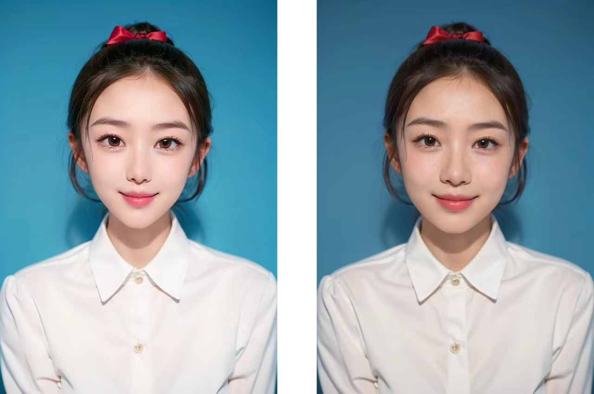
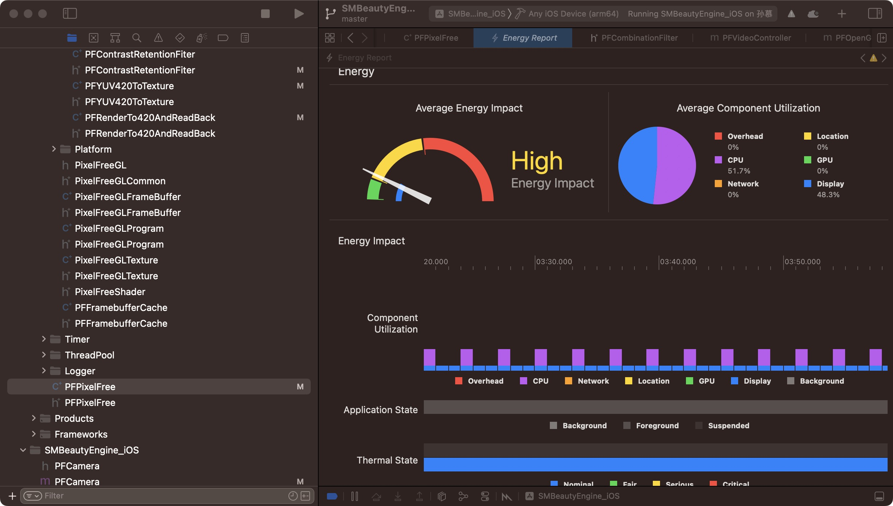

# pixelFree - Commercial Grade Beauty SDK

> Lightweight, high-performance beauty effects SDK with cross-platform support

[English](./README_en.md) | [中文](./README.md)

---

## 📖 Project Introduction

**pixelFree** is a lightweight, high-performance SDK developed based on years of graphics learning and research, primarily designed for live streaming, short videos, ID photos, photo processing, camera apps, and more.

### Key Features

- 🎨 Camera color tuning
- 💄 Beauty & face shaping
- 💋 Makeup
- 🎭 2D stickers
- 🎬 Green screen background replacement

> 💡 For integration reference, please see the **pixelFreeEffects** demo app.

---

## ✨ Beauty Effects

Achieves skin smoothing while preserving details - the perfect balance between enhancement and authenticity.

### Demo Videos

- [One-Tap Beauty YouTube](https://youtube.com/shorts/DrH07vYCjxo?feature=share)
- [Skin Smoothing YouTube](https://youtube.com/shorts/HyrIGTSJ2zw)
- [Face Shaping YouTube](https://youtube.com/shorts/LIqiX36eK5o)
- [Filters YouTube](https://youtube.com/shorts/31kJmS0pXQo)
- [Stickers YouTube](https://youtube.com/shorts/7lc1k9PGsNA)
- [Color Tuning YouTube](https://youtube.com/shorts/JkV4KY5Qkbo)

**Demo 1** Parameters: Whitening (0.6), Rosy (0.6), Skin Smoothing (0.7), Sharpening (0.2), Eye Enlarging (1.0), Face Slimming (1.0), V-Shape (1.0), Chin (1.0)

**Demo 2**: Dynamic Stickers

---

## ⚡ Performance

Full feature performance test:

---

## 🌐 Supported Platforms

| Platform | System Version |
| :------- | :------------- |
| iOS | > 9.0 |
| Android | > 5.0 |
| Windows | > 10.0.0 |
| HarmonyOS | > 12.0 |
| Flutter | >= 3.3.0 |
| Linux | Supported |

---

## 🎯 Feature List

| Category | Sub-features |
| :------- | :----------- |
| **Basic Beauty** | Whitening, Skin Smoothing, Rosy, Sharpening, Eye Brightening, Remove Nasolabial Folds, Remove Dark Circles, Teeth Whitening, AI Blemish Removal |
| **Filters** | 50+ options available |
| **Face Shaping** | Eye Enlarging, Face Slimming, Narrow Face, Forehead, Chin, Nose Slimming, V-Shape, Short Face, Philtrum, Long Nose, Eye Distance, Smile, Eye Rotation, Eye Corner |
| **Body Shaping** | Full-body slim, belly, waist, hourglass waist, curves, full-body narrow, hip lift, hip/bust enhancement, longer legs, swan neck, shoulders, upper/lower arms and legs, etc. (`PFBodyBeautyType`; default 0.5 neutral, range 0–1) |
| **One-Tap Beauty** | Natural, Cute, Goddess, Fair |
| **Camera Tuning** | Brightness, Contrast, Exposure, Highlights, Shadows, Saturation, Temperature, Hue (Global HLS adjustment, key color adjustment) |
| **Face Stickers** | 60+ 2D stickers available |
| **Green Screen** | Background replacement (green screen only, not portrait segmentation) |
| **Custom Watermark** | Input watermark image and position |
| **Makeup** | 10 full makeup looks, supports eyebrow, blush, eyeshadow, eyeliner, eyelashes, lipstick, highlight, shadow, foundation intensity adjustment |

---

## 🎬 Supported AV Solution Providers

- Qiniu
- Agora
- Tencent
- ZEGO

---

## 📚 Integration Guides

- [iOS Integration](./doc/doc_iOS.md)
- [Android Integration](./doc/doc_android.md)
- [Flutter Integration](./doc/doc_flutter.md)
- [Windows Integration](./doc/doc_windows.md)
- [FAQ](./doc/frequently_asked_questions.md)
- [Release Notes](./doc/release_note.md)
- [Custom Stickers](./doc/custom_stickers.md)

---

## 📱 Demo Apps

### Android

**Download**: https://www.pgyer.com/Cy9pG8

### iOS

**Download**: https://testflight.apple.com/join/KWUMyqrh

---

## ⚠️ Disclaimer

All demonstration materials are sourced from the internet. If any infringement occurs, please contact us (WeChat: 17376595626, Email: [idphoto007@163.com](mailto:idphoto007@163.com)) for immediate removal.
